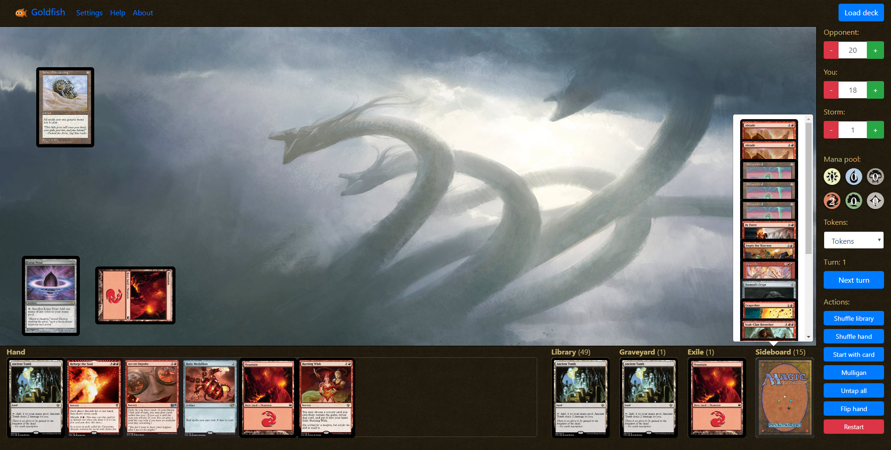

  

#  MTG Goldfish
Website to playtest (goldfish) Magic The Gathering decks - http://goldfish.sboulema.nl

## Features
- Load deck and sideboard from text, [MTGStocks](https://www.mtgstocks.com/) or [MTGGoldfish](https://www.mtggoldfish.com/)
- Keep track of life totals
- Custom counter for eg. storm or poison counters
- Keep track of your mana pool
- Keep track of current turn
- Flip or morph cards
- Add counters to cards
- Write custom text on counters
- View cards in all zones (hand, library, graveyard exile, sideboard)
- Keyboard shortcuts
- Select and add tokens
- Create custom tokens
- Start with a specific card in hand
- Tap cards
- Drag & drop cards between all zones
- Custom background

## Building
- npm install
- npm run gulp

## Running

`docker run -p 80:80 sboulema/mtggoldfish`