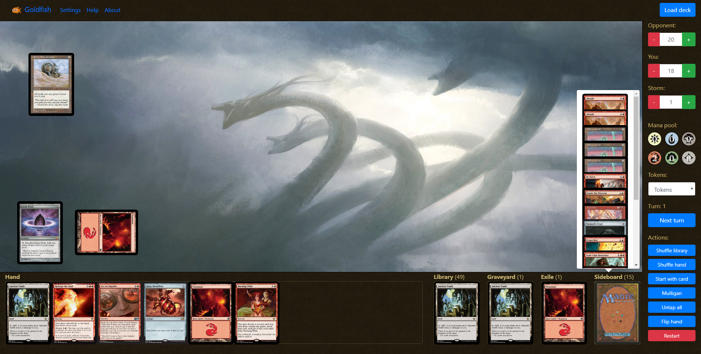

  

#  MTG Goldfish
Website to playtest (goldfish) Magic The Gathering decks - http://goldfish.sboulema.nl

## Features
- Load deck and sideboard from text, file (.txt, .dec, .dck), [MTGStocks](https://www.mtgstocks.com/) or [MTGGoldfish](https://www.mtggoldfish.com/)
- Keep track of life totals (configurable starting total for Commander, Brawl, etc.)
- Custom counter for eg. storm or poison counters
- Keep track of your mana pool
- Keep track of current turn
- Flip or transform double-faced cards
- Add counters to cards
- Add copy count badges to track duplicate cards
- View cards in all zones (hand, library, graveyard, exile, sideboard, commander)
- Commander zone with commander tax tracker
- Sideboard swaps for game 2
- Keyboard shortcuts (tap, flip, draw, graveyard, exile, library, mulligan, and more)
- Select and add tokens
- Create custom tokens
- Start with a specific card in hand
- Tap cards
- Drag & drop cards between all zones
- Custom background
- Dice roller (d4, d6, d8, d10, d12, d20) and coin flip

## Building
- npm install
- npm run gulp

## Running

`docker run -p 80:80 sboulema/mtggoldfish`

## Links
- [Bootstrap](http://getbootstrap.com/)
- [Cockatrice Magic Token](https://github.com/Cockatrice/Magic-Token)
- [Goldfish icon](http://www.iconarchive.com/show/flat-animal-icons-by-martin-berube/gold-fish-icon.html)
- [Knuth Shuffle](https://git.daplie.com/Daplie/knuth-shuffle/)
- [Mana Font](https://mana.andrewgioia.com/)
- [Open source mobile phone detection](http://detectmobilebrowsers.com/)
- [Scryfall API](https://scryfall.com/docs/api)
